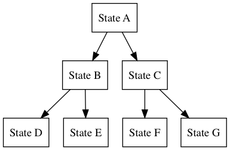
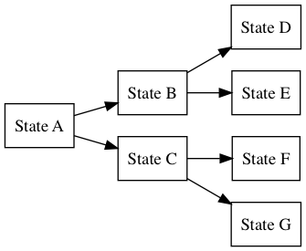

# Mikado Graph Generator [](https://travis-ci.org/snasirca/mikado-graph-generator) [](https://codeclimate.com/github/snasirca/mikado-graph-generator/maintainability)

Welcome to a DSL for creating Mikado Graphs using *GraphViz*.

## Installation

Add this line to your application's Gemfile:

```ruby
gem "mikado_graph"
```

And then execute:

    $ bundle

Or install it yourself as:

    $ gem install mikado_graph

### Prerequisites

Ensure you have *GraphViz* installed. On MacOS you can install it using Homebrew with the following command:

```bash
brew install graphviz
```

## Usage

You can use this gem's DSL in the following way to create a Mikado Graph generator definition file:

```ruby
require "mikado_graph"

MikadoGraph::Generator.define do
  state("State A").with_prerequisites do
    state("State B").with_prerequisites do
      state("State D")
      state("State E")
    end
    state("State C").with_prerequisites do
      state("State F")
      state("State G")
    end
  end
end.generate("png", "img/example_usage_vertical.png") # generate takes GraphViz format and output path
```

> You can also use the shorthand `with_prereqs` instead of `with_prerequisites` for defining prerequisite 
dependencies between states.

Save this file to `example_usage_vertical.rb` and then you can then execute this file in the terminal using:

```bash
ruby example_usage_vertical.rb
```

This will utilize *GraphViz* to create this PNG output of the above Mikado Graph generator definition:



NOTE: If you don't provide any parameters to `generate`, it'll default to a `dot` output in the STDOUT.

If you want to instead do a horizontal orientation of your graph, simply provide the direction flag to `#generate` like so:

```ruby
generate(direction: :horizontal)
```

Here is an example usage:

```ruby
require "mikado_graph"

MikadoGraph::Generator.define do
  state("State A").with_prerequisites do
    state("State B").with_prerequisites do
      state("State D")
      state("State E")
    end
    state("State C").with_prerequisites do
      state("State F")
      state("State G")
    end
  end
end.generate(format: "png", path: "img/example_usage_horizontal.png", direction: :horizontal)
```

This will generate this graph:



## Development

After checking out the repo, run `bin/setup` to install dependencies. Then, run `rake spec` to run the tests. You can also run `bin/console` for an interactive prompt that will allow you to experiment.

Use `direnv` to speed development.

## Contributing

Bug reports and pull requests are welcome on GitHub at https://github.com/snasirca/mikado_graph_generator. This project is intended to be a safe, welcoming space for collaboration, and contributors are expected to adhere to the [Contributor Covenant](http://contributor-covenant.org) code of conduct.

## License

The gem is available as open source under the terms of the [MIT License](http://opensource.org/licenses/MIT).
